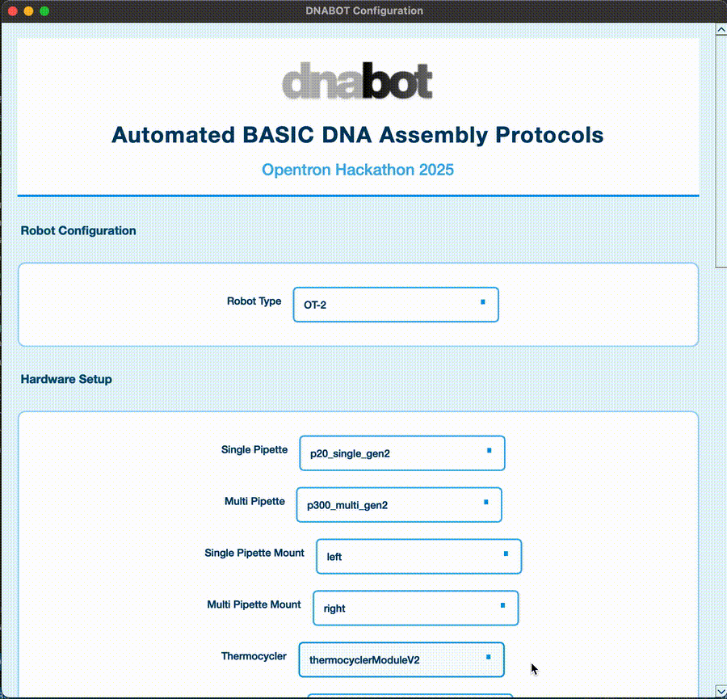
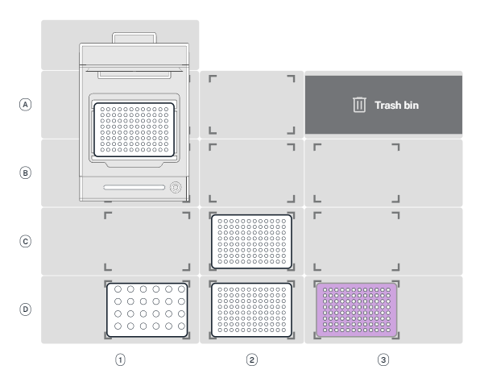
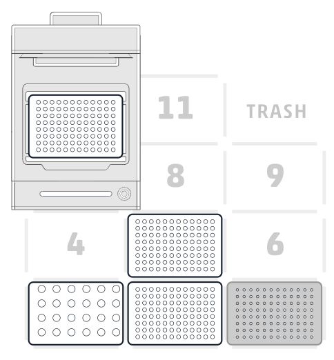

<br>

<p align="center">
  
</p>


# Automating BASIC DNA Assembly on the Opentrons OT-2 and Flex

Opentron Hackathon MRes SSB 2025/26

**Team Members:**  
Trisha Bhallamudi  
Salah-Uddin Hasan  
Sofie Rüffer  
James Yu  

<br>

## Introduction

Our project focused on optimizing how the BASIC DNA assembly workflow is automated on the Opentrons OT-2 and Flex robots. BASIC assembly can be quite fiddly in practice, especially during the CLIP reaction, as well as handling magnetic beads by hand which often leads to inconsistencies affecting downstream processing.

Therefore, our goal was to essentially streamline and optimise the workflow by running BASIC assembly on Opentrons OT-2 and Opentrons Flex. Additionally, create a unified template system and improve usability through a modernised GUI. Most importantly, validate performance via wet-lab clip reactions and volumetric tests

To do this, we split the project into two parts:  
(1) Fixing and upgrading the DNABot app software  
(2) Running and validating the BASIC CLIP reaction on the robots.

<br>

## What we built

We started with a preliminary version of the DNABOT from Professor Baldwin’s lab. However, we quickly ran into a few problems:
- Broke due to API changes
- Used incompatible labware definitions
- Contained incorrect logic and naming
- Could not reliably generate Flex protocols
- Required rewriting duplicate versions of the same protocol

Our project fixes these issues and prepares DNABOT for future FLEX-compatible and universal operation.

**Universal Template Architecture**  

The original DNABOT used two completely separate protocol templates:
(i) OT-2_clip_template_v2_21.py
(ii) Flex_clip_template_v2_21.py

We troubleshooted the UNIVERSAL_clip_template.py which the app uses to generate the files above to ensure all conditional blocks and compatible on both the Flex and OT-2 robots.

This eliminates duplicated code and will allow scaling in the future.

We also had to design and add custom labware because of:
- Incorrect trash location
- Undefined labware (tiprack_1000, mag_plate)
- Missing modules (MagDeck, Thermocycler)
- Flex protocols labelled as OT-2 due to metadata mismatch

<br>

<p align="center">
  
</p>

<br>


## Error Fixes (Summary):

We encountered and fixed a few issues.

### API & Syntax Errors

Mixed API versions inside the same file

Incorrect metadata["apiLevel"] - required syntax varied for OT-2 and Flex:
  - Flex needed a separate 'requirements' dictionary stating robot type and api level, wheras for OT-2 that information was needed to be added to the metadata dictionary.       We worked around this by adding the requirements dictionary as necessary, but also including api level in the metadata. In the output script we have comments informing      the user to comment out the requirements dictionary when running on an OT-2 platform. This is a rpoblem that needs to be fixed in the future.

OT-2 using Flex-only commands

Missing imports and undefined dictionaries


### Labware & Hardware Issues

Incorrect trash location

Undefined labware (tiprack_1000, mag_plate)

Missing modules (MagDeck, Thermocycler)

Flex protocols labelled as OT-2 due to metadata mismatch


### Logic Errors

Incorrect linker/part volume logic

Faulty if/else blocks

Undefined variables (tube_rack, destination_plate)

Incorrect tip index handling (global variable fix → nonlocal)


### GUI Issues

Cannot view selected files

Dropdown options not adaptive

Needed layout and title redesign

Flex labware shown when OT-2 selected

Required user to type in all labware and hardware names; names can get long and complicated so high susceptibility for 'Undefined' errors


### Environment / Dependencies

Original app required manual installs.
 We consolidated all into:
  requirements.txt

<br>

## Experimental Validation & Calibration Tests

We essentially ran the OT-2 clip reaction, Flex clip reaction, Fluorescent dye substitution tests and gradient mapping for volumetric validation using Coumarin 30 (DNA analogue) , Fluorescein (linker analogue), PBS (Master Mix + diluent). All in all, these runs validated pipetting reliability, plate mapping accuracy, flex calibration and correct mixing ratios GUI → template → final protocol workflow

We performed gradient tests where fluorescence intensity tracked expected linear increases in coumarin 30 concentration. OT-2 and Flex were experimentally compared. Flex required recalibration and pipette replacement during the process.

<br>

<p align="center">
  
  
</p>


<br>

## Installation & Running

<br>

**Clone Repository:**
```bash
git clone https://github.com/Imperial-Opentrons-Users/MRes_2025_Protocols.git
```

```bash
cd ./MRes_2025_Protocols/Team\ 1/
```

<br>

**Install dependencies:**
```bash

pip install -r requirements.txt

```

The Warning/Error Message can just be ignored, as it does not affect the Code and GUI in any way.

<br>

**Run GUI:**
```bash

python dnabot_app_2_2.py

```
The final protocol files are stored in the same folder as the csv files, in our case in the "data" folder.

<br>

**Run CLI:**
```bash

python dnabot_app_2_2.py nogui \
  --robot_type Flex \
  --construct_path ./data/constructs_temp.csv \
  --source_paths ./data/BIOLEGIO_BASIC_RBS_EXT_SET.csv ./data/part_plate_2_230419.csv

```

CLI mode uses values from `default_settings_2_2.yaml` by default. You can override clip parameters at the command line if needed:

```bash

python dnabot_app_2_2.py nogui \
  --robot_type Flex \
  --construct_path ./data/constructs_temp.csv \
  --source_paths ./data/BIOLEGIO_BASIC_RBS_EXT_SET.csv ./data/part_plate_2_230419.csv \
  --premix_linkers Yes \
  --premix_parts No \
  --linkers_volume 20 \
  --parts_volume 15 \
  --thermo_temp 4

```

<br>

## High-Level System Overview

```
          ┌─────────────────────────────────────────────────────────────────────┐
          │                            DNABOT SYSTEM                            │
          │      Automated BASIC Assembly Protocol Generator for Opentrons      │
          └─────────────────────────────────────────────────────────────────────┘
                                             │
                                             ▼
          ┌─────────────────────────────────────────────────────────────────────┐
          │                          CONFIGURATION LAYER                        │
          │                         default_settings_2_2.yaml                   │
          │   • Hardware + labware definitions                                  │
          │   • BASIC workflow parameters                                       │
          └─────────────────────────────────────────────────────────────────────┘
                                             │
                                             ▼
          ┌─────────────────────────────────────────────────────────────────────┐
          │                           USER INPUT (GUI)                          │
          │                           dnabot_gui_2_2.py                         │
          │   • Select robot + modules + labware                                │
          │   • Upload Construct CSV + Part CSVs                                │
          │   → Produces a unified user_settings object                         │
          └─────────────────────────────────────────────────────────────────────┘
                                             │
                                             ▼
          ┌─────────────────────────────────────────────────────────────────────┐
          │                           APPLICATION CORE                          │
          │                           dnabot_app_2_2.py                         │
          │   • Merges GUI input + YAML defaults                                │
          │   • Parses constructs + parts                                       │
          │   • Injects user- and experiment-specific parameters                │
          └─────────────────────────────────────────────────────────────────────┘
                                            │
         ┌─────────────────────────┬──────────────────────┬───────────────────┐
         ▼                         ▼                      ▼                   ▼
┌───────────────────┐ ┌──────────────────────┐ ┌────────────────────┐ ┌────────────────────┐
│   CLIP TEMPLATE   │ │ PURIFICATION TEMPLATE│ │  ASSEMBLY TEMPLATE │ │ TRANSFORMATION TEMP│
│ • Enzyme setup    │ │ • Magnetic cleanup   │ │ • BASIC assembly   │ │ • Competent cells  │
│ • Mastermix logic │ │ • Wash + elution     │ │ • Thermocycling    │ │ • Heat-shock steps │
└───────────────────┘ └──────────────────────┘ └────────────────────┘ └────────────────────┘
         │                         │                     │                    │
         ▼                         ▼                     ▼                    ▼
┌───────────────────┐ ┌──────────────────────┐ ┌────────────────────┐ ┌────────────────────┐
│  CLIP protocol    │ │ Purification prtocol │ │ Assembly protocol  │ │ Transformation     │
│  final Python API │ │ final Python API     │ │ final Python API   │ │ final Python API   │
│  (OT-2 / Flex)    │ │ (OT-2 / Flex)        │ │ (OT-2 / Flex)      │ │ (OT-2 / Flex)      │
└───────────────────┘ └──────────────────────┘ └────────────────────┘ └────────────────────┘
```

<br>

## Repository Overview

```
MRes_2025_Protocols/Team 1
├── data/
│   └── BIOLEGIO_BASIC_RBS_EXT_SET.csv          
│   └── constructs_temp.csv
│   └── part_plate_2_230419.csv                                  
├── images/
│   └── dnabot_logo.png          
├── running_protocols/
│   └── 1_Flex_clip_APIv2_21_WORKING.py        # Opentrons Flex running protocol for CLIP reaction
│   └── 1_OT-2_clip_APIv2_21_WORKING.py        # OT-2 running protocol for CLIP reaction
│   └── ...       
├── template_opentrons_scripts/
│   └── 1_UNI_clip_template_APIv2_21_final.py  # Universal template file for Opentrons flex/OT-2 CLIP reaction
│   └── ...         
├── default_settings_2_2.yaml                  # Defined Labware and Hardware for Opentrons Flex and OT-2
├── dnabot_app_2_2.py                          # App entrypoint with GUI and CLI      
├── dnabot_gui_2_2.py                          # Updated and modernised GUI          
└── requirements.txt                           # Packages necessary to run the DNABOT App and GUI
```
